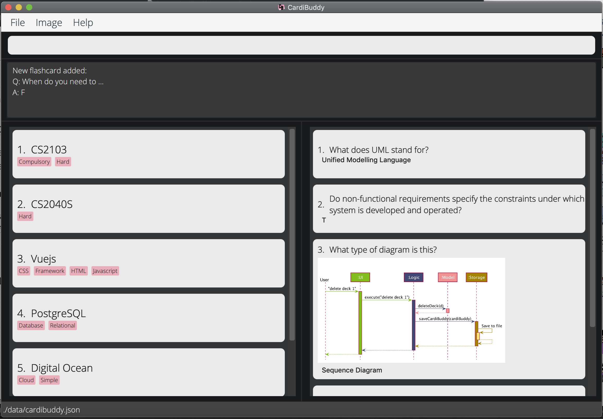
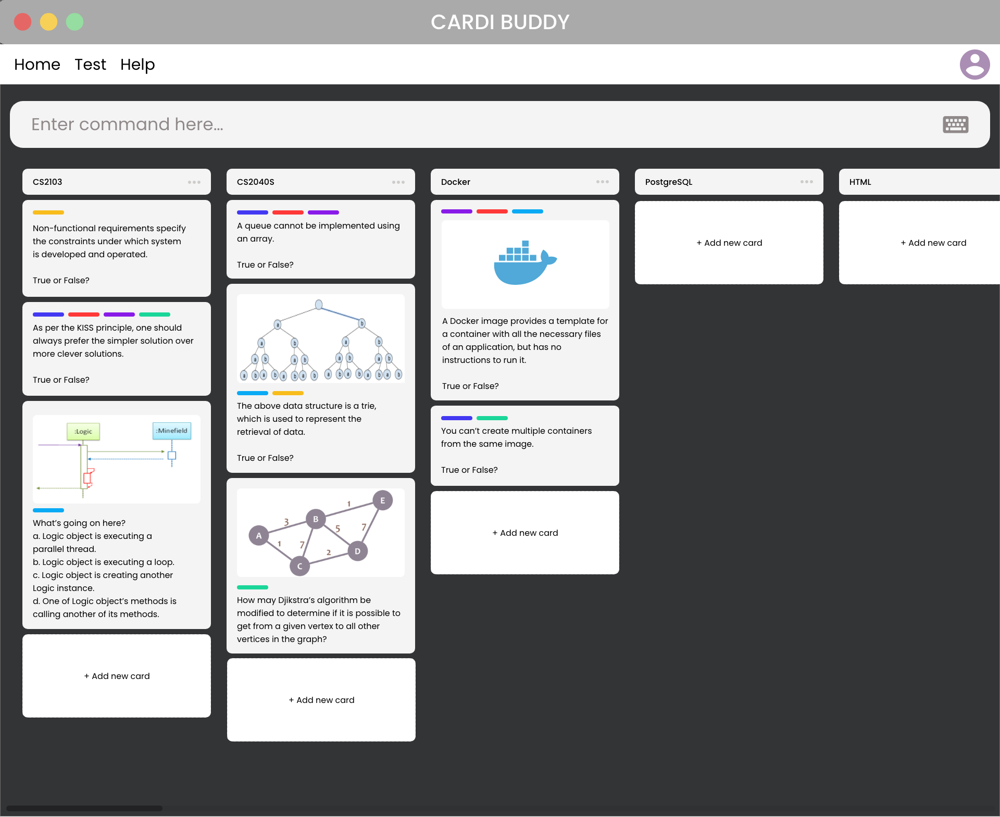

= Cardi Buddy (CardiB)

https://travis-ci.com/AY1920S2-CS2103T-T10-2/main[image:https://travis-ci.com/AY1920S2-CS2103T-T10-2/main.svg?branch=master[Build Status]]
https://coveralls.io/github/AY1920S2-CS2103T-G09-2/main?branch=master[image:https://coveralls.io/repos/github/AY1920S2-CS2103T-G09-2/main/badge.svg?branch=master[Coverage Status]]
image:https://api.codacy.com/project/badge/Grade/f8b5ed4e9c134355b556b8fc55befef4[link="https://app.codacy.com/gh/AY1920S2-CS2103T-T10-2/main?utm_source=github.com&utm_medium=referral&utm_content=AY1920S2-CS2103T-T10-2/main&utm_campaign=Badge_Grade_Settings"]
image:https://img.shields.io/badge/license-MIT-blue.svg[MIT License, link=LICENSE]

ifdef::env-github[]

endif::[]

ifndef::env-github[]

endif::[]

== What is Cardi Buddy?
Flash Cards allow you to learn _twice as fast_, and remember longer as proven by decades of cognitive science – they promote studying through active recall, which is one of the practices through which our brains learn most effectively.

*Cardi Buddy (CardiB)* is a flash cards application that allows students to generate their own flash cards and test themselves through a simple Command Line Interface. Through making your own flash cards, you are _processing, summarising and internalizing_ the content that you have learnt and creating _stronger neural pathways_ as opposed to using pre-made decks.

If you can type fast, CardiB can also help you to store revision materials in a blink of an eye. Instead of revising by re-reading lecture notes, CardiB allows you _break down complex concepts into simpler questions_ in multiple flash cards and create test sessions to run through unfamiliar concepts.

In addition, CardiB comes with a multitude of features specially designed for NUS SoC students taking content-heavy modules:

* *Drag and drop images* into flash cards to cater to visual learners
* *Detect duplicates* of flash cards to prevent repetition
* *Tag flash cards* for better organization
* *Search for flash cards according to Tags* to access relevant topics more efficiently
* *Prioritise flash cards* that have a higher frequency of incorrect answers in quizzes for more effective testing

What are you waiting for? Give CardiB a go and you will be sure to see improvements in your examination grades to get that elusive A!

== Table of Contents

* <<UserGuide#, User Guide>>
* <<DeveloperGuide#, Developer Guide>>
* <<AboutUs#, About Us>>
* <<ContactUs#, Contact Us>>

== Acknowledgements

* Some parts of this sample application were inspired by the excellent http://code.makery.ch/library/javafx-8-tutorial/[Java FX tutorial] by
_Marco Jakob_.
* This product is based on the source code from AddressBook-Level 3 project created by https://se-education.org[SE-EDU] initiative
* Libraries used: https://openjfx.io/[JavaFX], https://github.com/FasterXML/jackson[Jackson], https://github.com/junit-team/junit5[JUnit5]

== Licence : link:LICENSE[MIT]
